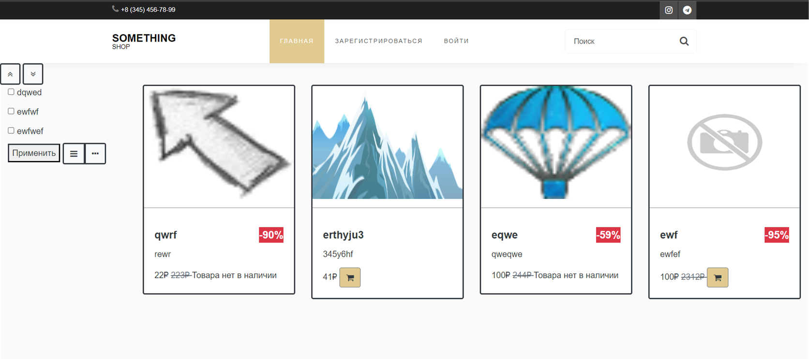

# Запуск
```
pip install requirements.txt
```
# Использованные технологии:
1. flask-wtf
2. sqlalchemy
3. flask
4. flask-login
5. SQLAlchemy-serializer
6. flask_restful
7. requests

# Онлаин магазин
